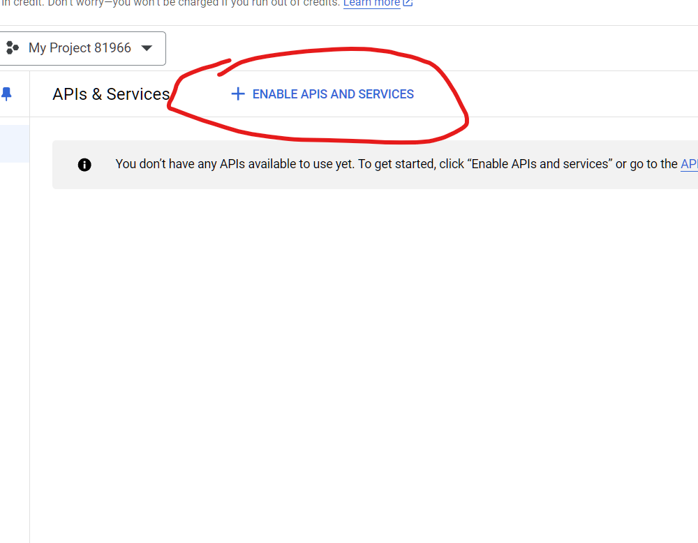
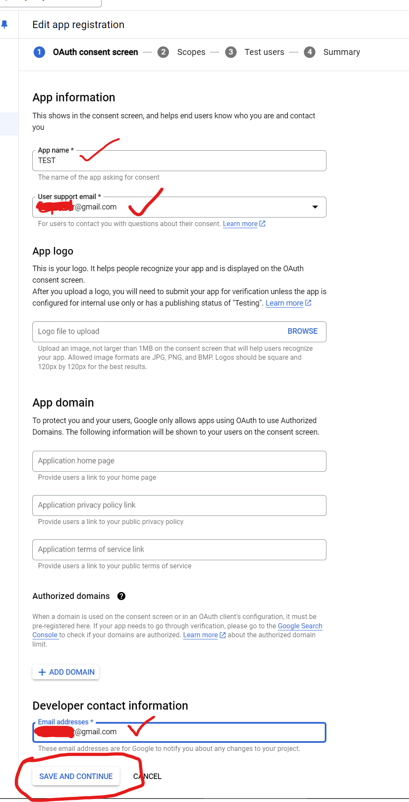
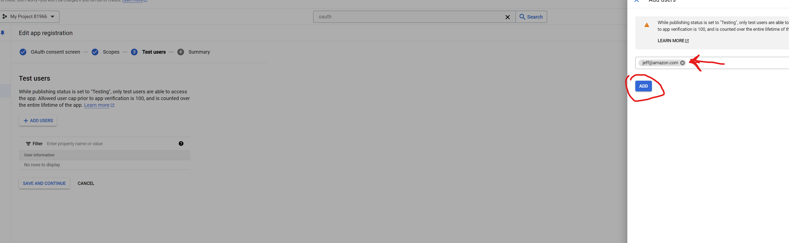
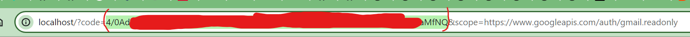

# email-summarizer
groups by email addresses with most unread emails to least

Steps:
---
## 1. Login into https://console.cloud.google.com/
## 2. Create a project

 

## 3. Click Go to APIs Overview

## 4. Click Enable API AND SERVICES

## 5. Type Gmail and click Gmail API

## 6. Search for oauth consent screen

## 7. Click external

## 8. Fill out name and email addresses

## 9. Click Add or Remove Scopes

## 10. Type Gmail to search for it

## 11. Select read only

## 12. Add yourself and others as Test Users

## 13. Done with Consent Screen Go back to Dashboard

## 14. Go to Credentials and create credentials

## 15. Download credentials

## 16. RENAME file to credentials.json

## 17. Download app.js file in this repo
## 18. Download and install Nodejs if you dont have it
https://nodejs.org/en/download/prebuilt-installer

## 19. Put app.js, credentials.json in one folder. Open bash or cmd or terminal etc.. and run
node -v
if you see no errors you have nodejs installed

then run 

npm install

then run 

node app.js

## 20. Click the link or copy/paste in browser

## 21. Confirm

## 22. Copy paste this code into terminal

## 23. Results

